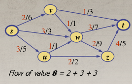
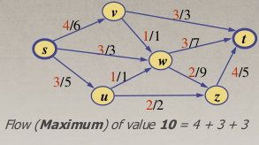
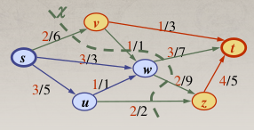
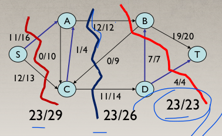
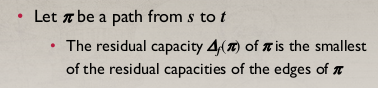
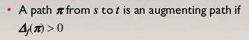
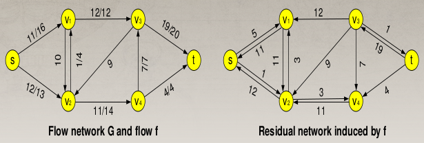
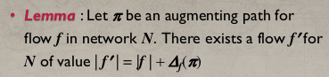
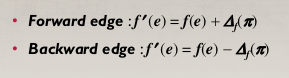
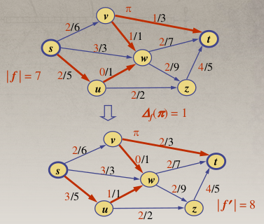

# Flow network
---

# Terminologies:

**Flow Network:** A flow network **N** is a weighted directed graph **G**, where the weight of edges is called capacity.

**Flow:** The value of the flow of a network **f**, denoted **|f|**, is the total flow going from the source **s**, which is equal to the total flow coming into the sink **t**.

**Maximum Flow:** The maximum flow problem involves finding the maximum flow from the source **s** to the sink **t** in a flow network **N**.

---

**Cut:** A cut of a flow network **N** is a partition of vertices **X = (Vs, Vt)**, where **Vs** is the set of vertices that includes the source **s**, and **Vt** is the set of vertices that includes the destination **t**.

**Forward edge of a cut X:** Origin in **Vs** and destination in **Vt**.  
**Backward edge of a cut X:** Origin in **Vt** and destination in **Vs**.
**Capacity of a cut C(X):** Total capacity of forward edges.  
**Flow of a cut f(X):** Total flow of forward edges minus the total flow of backward edges.

---
**Theorem:** The flow value across the network **N**, **|f|**, is equal to the flow of any cut **f(X)**.  
**Theorem:** The value of any flow (flow of a cut or the entire network) is less than or equal to the capacity of any cut.

---

**Minimum Cut:** A minimum cut is the cut whose capacity is the smallest among all possible cuts.  

In a graph, there can be multiple minimum cuts.

**Theorem (Max-Flow Min-Cut):** The value of the maximum flow is equal to the capacity of the minimum cut.

For example in this graph max flow = minimum cut = 23.

**If we can find the capacity of the minimum cut, then we have found the maximum flow. However, finding the capacity of the minimum cut is more difficult than finding the maximum flow using max flow algorithms.**

---

**Residual capacity of edge and path:**

**Residual Capacity (RC) of edges:**  

- **RC of a edge $\textbf{e}$, in forward direction from $\textbf{u}$ to $\textbf{v}$:**  
  $\Delta f(\textbf{u}, \textbf{v}) = c(\textbf{e}) - f(\textbf{e})$  
  (This is the capacity of the edge minus the flow of the edge.)  

- **RC of a edge $\textbf{e}$ in reverse direction from $\textbf{v}$ to $\textbf{u}$:**  
  $\Delta f(\textbf{v}, \textbf{u}) = f(\textbf{e})$  
  (This is the flow of the edge in forward direction. why do we consider edges in reverse direction? explained below)  
  

**Residual Capacity of a path from source to destination:**  
Let $\pi$ be a path from $\textbf{s}$ to $\textbf{t}$. The residual capacity $\Delta f(\pi)$ of $\pi$ is the smallest of the residual capacities of the edges in $\pi$.

**Augmenting Path:**  

**Residual Network:** If we replace the flow/capacity of the edges with the residual capacity of the edges, then the flow network we get is called the residual network.

---

**Flow Augmentation:** This is the key iteration in all flow algorithms when finding the maximum flow.

While running the max flow algorithm, in each DFS or BFS iteration, it involves increasing the flow along an augmenting path.

**Flow augmentation involves:**  
**Forward edges:** Increasing the flow of each edge by the amount of the residual capacity of the augmenting path.  
**Backward edges:** Decreasing the flow of each edge by the amount of the residual capacity of the augmenting path.

**Example of flow augmentation:**

---

## Why decrease backward edges flow? (this is a very crucial to understand):  

Let’s say the current flow considered is:

By direct observation, if we don't undo **v → w** flow **5** and consider flow **5** towards **v → t**, there is no way to increase the max flow of the network.

OK!!, let’s consider an augmenting path in the flow **s → u → w → v → t**.  

Look at the **w → v** edge. It is reversed, i.e., **v → w** exists but not **w → v**. But we have to consider **w → v** because there might be the possibility of undoing **v → w** flow. How? Let’s look.

If we perform flow augmentation along **s → u → w → v → t**, the network becomes:

Previously, **s → v** flow was **5**, which went through **v → w** and then **w → t**. Now **v → w** is **0**, and **v → t** is **5**.

Now the question is: does this mean a flow is happening in this path **s → u → w → v → t**? The answer is NO. What actually happened was, initially, we considered flow **s → v → w → t**, but it blocked any flow in **s → u →** direction.  

So, we needed to cancel out or undo **v → w** flow, which we did by considering **w → v** along **s → u → w → v → t**.  

Thus, the flow is actually happening along **s → v → t (5)** and **s → u → w → t (5)**.
 

---

**If we don’t consider flow undoing (sending flow through reverse edges), we would have to find an algorithm that always chooses augmenting paths intelligently. This is an NP-Hard problem.**

**However, if we consider flow undoing (sending flow through reverse edges), we can arbitrarily choose any augmenting path without worry. Because if the current path was not ideal, in later iterations, we can undo the flow of edges.**

This is exactly what max flow algorithms do, which is why they have polynomial complexity.

---

**So, For max flow algorithms, we add a reverse edge for each edge to achive flow undoing.**

 

**Capacity of edge:** Equal to the capacity of the edge.  
**Capacity of reverse edge:** Equal to the flow of the edge. [Why? Because that is the maximum amount of flow we can cancel or undo for this edge.]

---

# Now you are ready for flow algorithms, you know all basic terminologies
