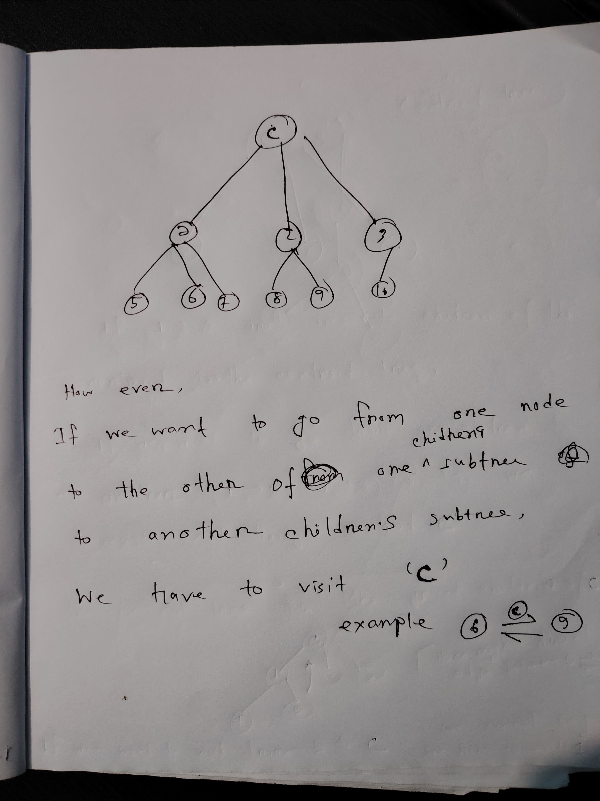

# Centroid Decomposition

# What is Centroid Decomposition?

Centroid decomposition is a divide and divide and conquer technique used in the analysis of trees, where the tree is repeatedly divided into subtrees by identifying centroids. A **centroid** of a tree is a node such that when it is removed, no resulting subtree has more than half the total nodes of the original tree. This decomposition splits the tree in a balanced way, allowing efficient processing of problems involving paths, distances, and more.

# Properties of Centroid Decomposition

## **1.Balanced Partition**: 

The centroid of a tree ensures that each subtree formed after its removal has at most half the number of nodes, which makes the decomposition highly balanced.

## **2.Centroid Tree**:

The centroid tree constructed from a tree has a depth of \( O(\log N) \), where \( N \) is the number of nodes in the original tree. **sort of like segment tree**

## **3.Unique Path Property**: 

In the centroid tree, any path between two nodes in **different** subtrees of a centroid must pass through the centroid in real tree.

**keep in mind that the subtrees must be different, if we are considering two nodes in the same subtree of the centroid tree, we cannot say that, in real tree it will go through the centroid, there might be direct/short edge connection between these two nodes that does not pass through the centroid, [see the lower half of the above picture]**

# Applications of Centroid Decomposition

Centroid decomposition is useful in solving tree-related problems where path-based queries are involved, and you need efficient updates and queries.

## 1. Path Queries of \( O(N^2) \) can be calculated in  O(N log N) :
   Centroid decomposition can be used to count or sum properties of paths between pairs of nodes in a tree. Since any path between nodes in different subtrees passes through the centroid, the tree can be efficiently processed in \( O(N \log N) \).
   
**Centroid decomposition is particularly useful for problems involving path counting in trees. Because, Once we have computed all the path-related information for a node 'v', we can safely disregard any paths that include 'v'. This allows us to remove 'v' from the tree and apply the same decomposition strategy to the remaining subtrees. By intelligently choosing 'v' as the centroid at each stage, we ensure that each operation takes at most O(NlogN) time, making it a highly efficient approach for solving path-related problems in trees.**

## 2. Distance Problems:
   If we need to compute distances between nodes or find the shortest paths, centroid decomposition helps break down the problem by removing centroids and solving the problem recursively.

## 3. Fixed-Length Paths:
   When tasked with finding paths of a fixed length in a tree, centroid decomposition can reduce the complexity by ensuring that each decomposition step only processes a subtree of size at most half the original.

---

